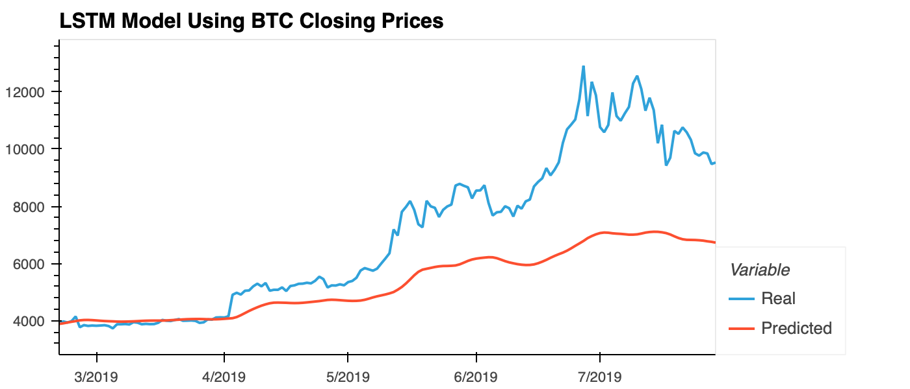
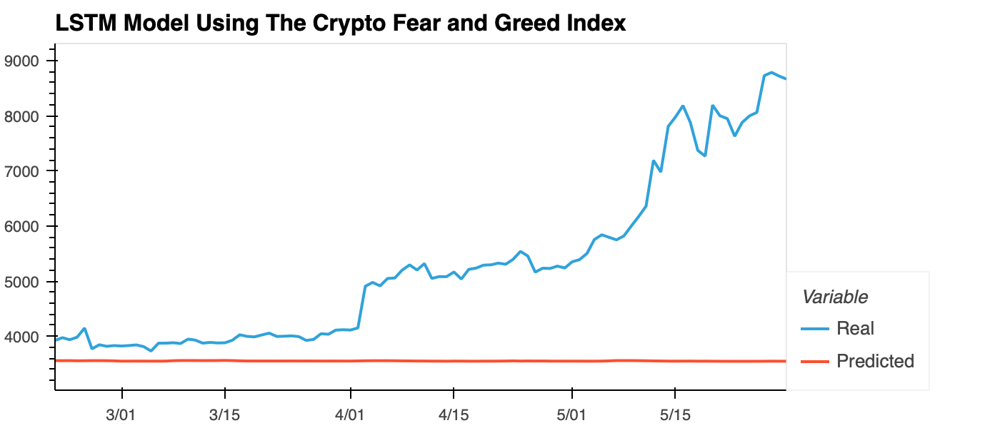

# LSTM Stock Predictor

Due to the volatility of cryptocurrency speculation, investors will often try to incorporate sentiment from social media and news articles to help guide their trading strategies. One such indicator is the [Crypto Fear and Greed Index (FNG)](https://alternative.me/crypto/fear-and-greed-index/) which attempts to use a variety of data sources to produce a daily FNG value for cryptocurrency. In this project i am building and evaluating deep learning models using both the FNG values and simple closing prices to determine if the FNG indicator provides a better signal for cryptocurrencies than the normal closing price data.

I'm using deep learning recurrent neural networks to model bitcoin closing prices. One model will use the FNG indicators to predict the closing price while the second model will use a window of closing prices to predict the nth closing price.

### Libraries

* pandas
* hvplot
* tensorflow
* keras
* sklearn libraries

# Summary

When comparing LSTM models using the Crypto FNG Index and BTC closing prices, we can see that using BTC closing prices the actual values are traced better over time. We can also see a smaller loss when compared to the FNG model. The window size that works best is 1 day. When window size is bigger, the less the model tracks the actual values over time and more loss there is. Predicting closing prices with such model is not advisable. However, it can be used to understand the predicted trend.

## Comparing LSTM Model

